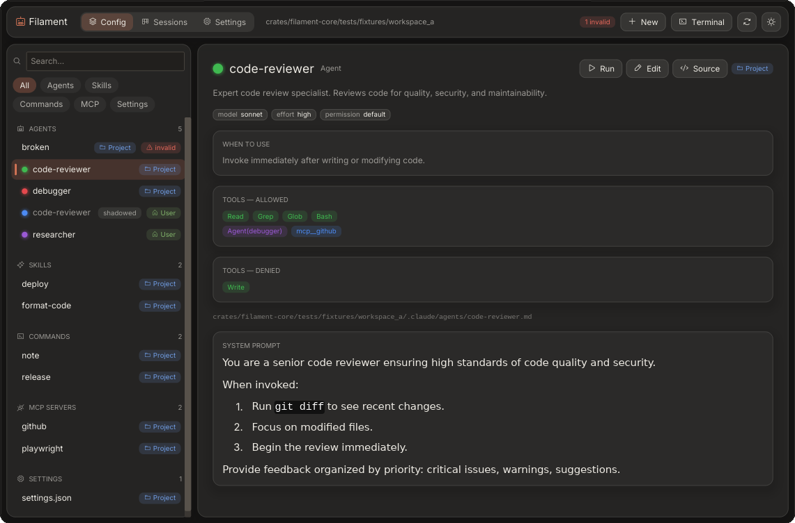
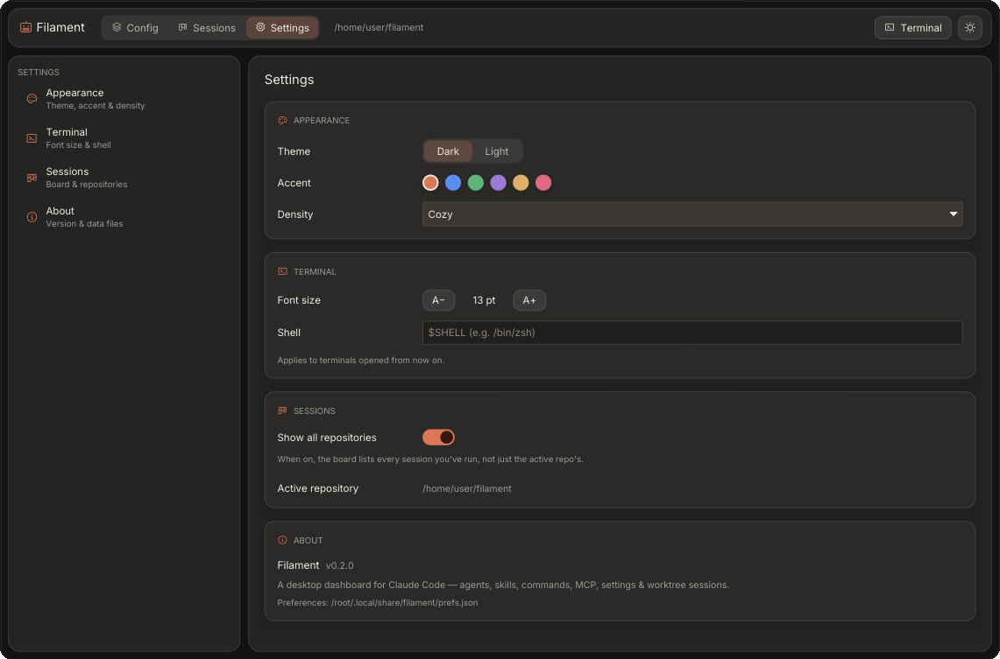
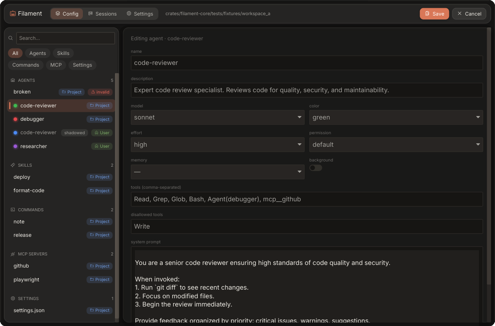
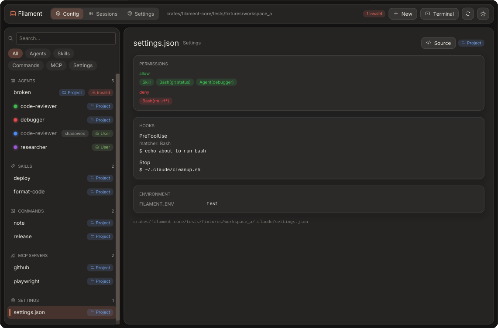
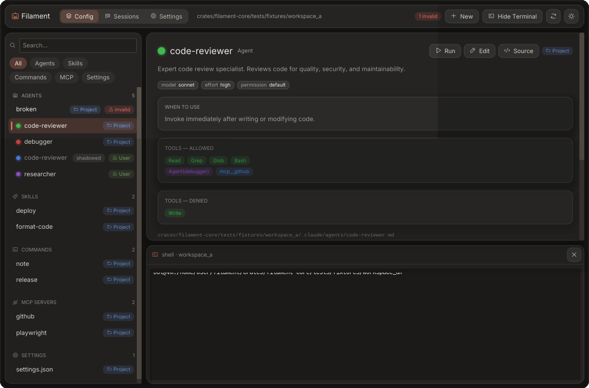
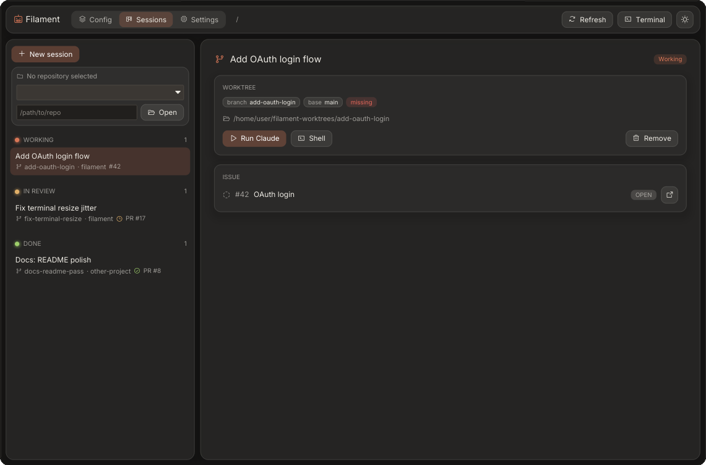

# Filament

A polished, cross-platform **desktop app for browsing and editing your Claude Code
configuration** — agents, skills, slash commands, MCP servers, and settings — in one
place, with the correct metadata, iconography, and scope/precedence made visible.

Written in **pure Rust** ([Iced](https://iced.rs)), no web stack.

A polished, native-feeling desktop app: a translucent **"glass" UI** (with real
backdrop blur where the OS supports it — macOS vibrancy, KDE/Wayland), [Phosphor]
icons throughout, and bundled **Inter** + **JetBrains Mono** fonts.



[Phosphor]: https://phosphoricons.com

## Why

Claude Code config lives in scattered Markdown + YAML and JSON files across
`~/.claude/`, project `.claude/` directories, and plugins, with non-obvious
precedence rules. There's no good way to *see* it at a glance, let alone edit it
safely. Filament turns the whole config into a legible, editable dashboard.

## Features

- **Everything in one view** — agents, skills, commands, MCP servers, and
  settings, grouped in a searchable sidebar with type icons, color swatches, and
  scope chips.
- **Rich inspector** — model/effort/permission/memory badges, color-coded tool
  chips (builtin / `mcp__…` / `Agent(…)` / skill, allow vs deny), MCP transport &
  env, settings permissions and hooks, and the system prompt rendered as live
  Markdown.
- **Scope & precedence** — see which definition *wins* when names collide across
  managed / project / user / plugin scopes; shadowed entries are marked.
- **Fuzzy search & filters** — instant filtering across names, descriptions, and
  kinds.
- **Editing** — a typed form for agents (dropdowns, toggles, validation) and a
  raw source editor for every kind. Saves are **lossless**: only the fields you
  change are rewritten, so comments, key order, and unknown fields survive
  verbatim. Writes are atomic.
- **Creation wizard** — scaffold a new agent, skill, or command into the scope of
  your choice from a template.
- **Sessions** — a crow-inspired worktree workflow: pair a git **worktree** with a
  Claude Code instance (and an optional GitHub issue / PR) per task, see them on a
  Working → In Review → Done board, and launch `claude` in the worktree with one
  click. (See [Sessions](#sessions--worktree-workflow) below.)
- **Integrated terminal** — an embedded terminal panel (Alacritty engine via
  `iced_term`) so you can run `claude` for the selected agent (the **Run**
  button) or any command, without leaving the app. *(Ghostty itself can't be
  embedded in an Iced/wgpu app yet — its renderer isn't released — so the
  terminal is Alacritty-backed.)*
- **Appearance & settings** — a dedicated **Settings** section to tune the look
  and feel: light/dark theme, an accent color (Claude coral by default), UI
  **density** (a global zoom from Compact to Spacious), the terminal font size and
  shell, and session defaults. Preferences persist in your OS data directory. The
  palette and typography are tuned to sit comfortably alongside Claude Code —
  warm, paper-and-ink neutrals rather than cold blue-grays.

  
- **Live refresh** — external edits to your config files show up automatically,
  thanks to a debounced filesystem watcher.
- **Invalid files don't break it** — a malformed file is listed with an error
  badge and its parse error, never crashing the scan.

| Editor | Settings & hooks |
| --- | --- |
|  |  |



## Sessions — worktree workflow

The **Sessions** section (toggle it in the header) brings the core idea of
[radiusmethod/crow](https://github.com/radiusmethod/crow) into Filament: instead
of juggling branches in one checkout, you spin up an isolated **git worktree** per
task and run Claude Code in it.



- **Pick a repository** — the board attaches to the git repository Filament was
  opened in. When it's launched from somewhere that isn't a repo (e.g. a
  double-clicked app bundle, whose working directory is `/`), it no longer guesses
  — instead it offers an **Open repository** field and a quick switcher across the
  repos you've worked in. The chosen repo is remembered between launches.
- **New session** — give it a title and/or a GitHub issue URL and pick a base
  branch. Filament creates a worktree on a fresh branch (in a sibling
  `<repo>-worktrees/` directory) and registers the session.
- **Board** — sessions are grouped **Working → In Review → Done**. The state is
  derived from the linked PR (open ⇒ In Review, merged ⇒ Done) and issue (closed
  ⇒ Done) when GitHub data is available. By default the board shows **every
  session you've run** across all repositories (toggle "Show all repositories" in
  Settings to scope it to the active repo).
- **Run Claude / Shell** — launch `claude` (or a plain shell) in the session's
  worktree, right in the embedded terminal — no `cd` dance.
- **Tickets** — open GitHub issues without a session show up as tickets; "Start
  working" turns one into a session in a click.
- **PR & CI status** — **Refresh** polls GitHub for each session's pull request:
  draft / review decision and a roll-up of CI checks (passing / pending /
  failing).
- **Orphan recovery** — worktrees created outside Filament are detected on load
  and can be **adopted** as sessions.
- **Safe deletion** — removing a session deletes its worktree, except when it's on
  a protected (base/default) branch, which is preserved.

GitHub features use the [`gh`](https://cli.github.com) CLI and are entirely
optional: when `gh` is missing or unauthenticated, sessions, worktrees, and the
terminal still work — only issue/PR data is unavailable, surfaced as a quiet hint.
Worktree management uses your installed `git` (no libgit2). Session metadata is
stored in your OS data directory, not in the repo.

## Install / build

**Prebuilt downloads:** pushing a `vX.Y.Z` tag runs two separate per-OS release
pipelines that publish a macOS `Filament.app` and a Linux tarball to the matching
GitHub Release. (CI also builds release binaries on every push across all three
OSes as a check.)

When the release pipeline's Apple Developer ID secrets are configured the macOS
`.app` is signed with a hardened runtime, **notarized**, and stapled, so it opens
with a normal double-click straight from the download.

If you're running an **unsigned** build (built from source, or a release made
before notarization was set up), a browser-downloaded copy is quarantined and
Apple Silicon shows *"Filament.app is damaged and can't be opened."* The app is
fine — just remove the quarantine attribute once, then open it normally:

```sh
xattr -dr com.apple.quarantine /Applications/Filament.app
```

(The right-click → **Open** trick only clears the milder "unidentified developer"
dialog, not the "damaged" one, so use the command above.)

**From source** — requires Rust 1.94+ (pinned via `rust-toolchain.toml`).

```sh
cargo build --release -p filament
./target/release/filament
```

**Linux** needs the usual GUI/runtime libraries:

```sh
sudo apt-get install -y libxkbcommon-x11-0 libwayland-client0 libfontconfig1
```

(For building, the `-dev` variants: `libxkbcommon-dev libxkbcommon-x11-dev
libwayland-dev libfontconfig1-dev`.)

## Usage

```text
filament [PATH | --workspace <dir>] [--home <dir>] [--no-user]
         [--select <name>] [--search <query>] [--sessions] [--settings]
```

- `--workspace <dir>` (or a bare path): the project to scan. Filament walks up to
  the git root collecting `.claude/` directories, reads `.mcp.json`, and merges in
  your user-level `~/.claude/`.
- `--home <dir>`: override the home directory (keeps dev/tests off your real
  `~/.claude`).
- `--no-user`: project scope only.
- `--select` / `--search`: deep-link to an item or prefill the search box.
- `--sessions`: open straight into the Sessions section.

Try it against the bundled fixtures:

```sh
cargo run -p filament -- \
  --workspace crates/filament-core/tests/fixtures/workspace_a \
  --home crates/filament-core/tests/fixtures/home
```

## Architecture

A Cargo workspace with two crates:

- **`filament-core`** — UI-free engine: the domain model, a byte-span frontmatter
  splitter, per-file parsers (errors captured as diagnostics, never panics),
  discovery + scope/precedence resolution, validation, and lossless edit / atomic
  write primitives. Also the session engine — a `git` worktree wrapper, the
  `session` model + JSON store, and `github` (`gh`-backed, gracefully degrading)
  integration. Fully unit-tested.
- **`filament`** — the Iced desktop app: sidebar, inspector, editor, wizard,
  theming (warm Claude-tuned palette + a small type/spacing scale), persisted
  preferences and a Settings screen, fuzzy search, the file-watch subscription,
  the embedded terminal, and the Sessions board.

The split keeps all parsing/editing logic fast to compile and testable headlessly.

## Development

```sh
cargo test --workspace                       # unit + integration tests
cargo clippy --workspace --all-targets -- -D warnings
cargo fmt --all --check
cargo deny check bans advisories sources     # supply-chain checks
```

CI (`.github/workflows/ci.yml`) runs fmt, clippy, tests, and a release build on
macOS, Windows, and Linux, plus `cargo-deny`.

## License

MIT — see [LICENSE](LICENSE).

Bundled fonts retain their own licenses: **Inter** and **JetBrains Mono** under
the SIL Open Font License 1.1, and **Phosphor** icons under MIT.
